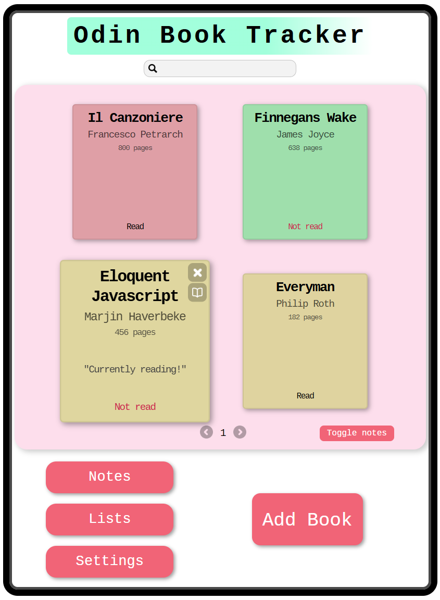
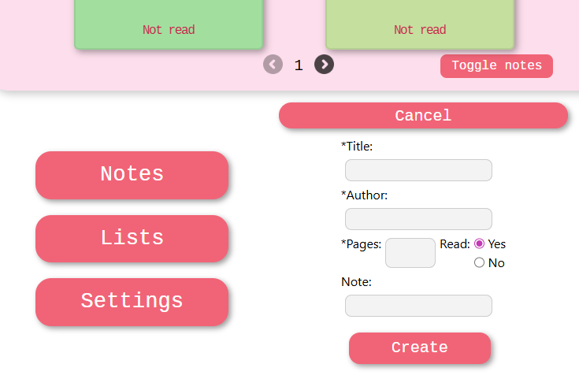

# Library Tracker App
A simulated app for tracking notes in a personal library. Created as part of the JavaScript curriculum of the Odin Project. The focus of this project is object manipulation. 

## Description

Book objects are created and placed in a library array. Virtual shelves are generated in an array based on the amount of books in the library and one shelf is displayed at a time as cards.

Randomly generated IDs, generated in the Book object, enable functions that delete the specific book and toggle the book as "Read" or "Not read". The library array and Book objects are updated accordingly.

Deleting a book and changing the page refreshes the library and shelves. This enforces consistency between the Book object properties and the appearance and locations of cards in the current shelf.

Page behavior is based on the cardPage variable. It increments and decrements as needed and is limited by the number of shelves generated.

# Other features

Similar to other curriculum projects, additional concepts are explored:

-A "Toggle notes" button shows notes on all books via CSS rules and an event listener that applies or removes a class to the card-wrapper section.

-Animation is used in some elements. Namely, the growth of the active or hovered card. Book notes also "sweep" into the frame. The edit buttons on each book also transition shape on press.

-The form used to add a new book is in placed in a details drawer.

*Clicking "Add Book" opens an animated drawer*

### Other considerations

The existing structure of this project could be expanded to include the following features:

-Local storage
-Function to update individual cards / book objects vs refreshing entire array
-Add additional buttons on each book to edit existing book properties, such as color and note.
-Search feature: add functions to search the shelf array for matching properties, display the shelf containing the matching books, and make the matching cases active (book expands).
-A table view of properties to easily edit notes.
-Add "hashtag"-style properties to books
-Creation of lists and custom views
-Customization and themes